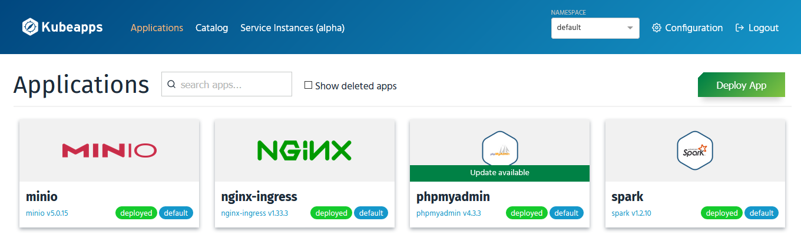
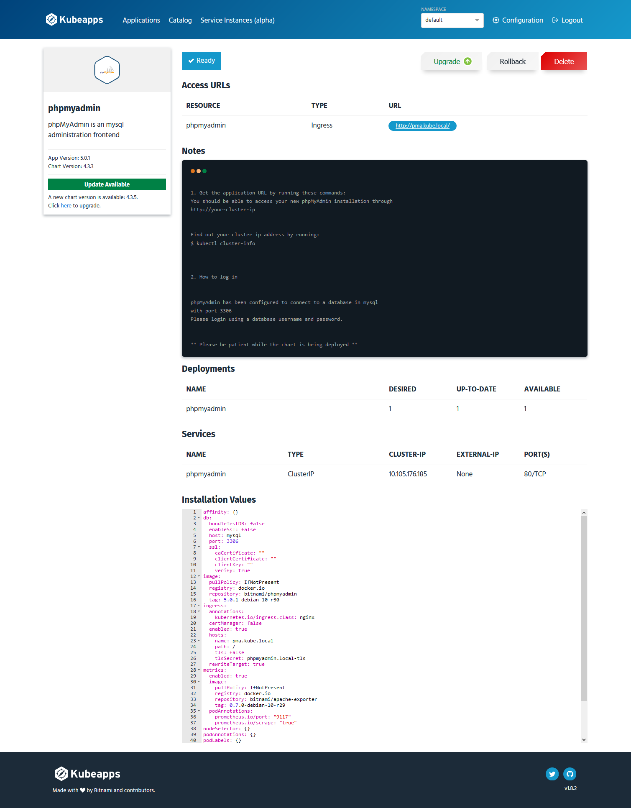

# Kubernetes Kubeapps
Kubeapps is a web-based UI for deploying and managing applications in Kubernetes clusters. Kubeapps allows you to:

- Browse and deploy [Helm](https://github.com/helm/helm) charts from chart repositories
- Inspect, upgrade and delete Helm-based applications installed in the cluster
- Add custom and private chart repositories (supports [ChartMuseum](https://github.com/helm/chartmuseum) and [JFrog Artifactory](https://www.jfrog.com/confluence/display/RTF/Helm+Chart+Repositories))
- Browse and provision external services from the [Service Catalog](https://github.com/kubernetes-incubator/service-catalog) and available Service Brokers
- Connect Helm-based applications to external services with Service Catalog Bindings
- Secure authentication and authorization based on Kubernetes Role-Based Access Control





## Install

Configure your options in `helm-values.yml` and deploy the chart :

```shell
kubectl create namespace kubeapps
helm install kubeapps --namespace kubeapps bitnami/kubeapps
```

Enable `Ingress` and you can access dashboard using [http://kubeapps.local](http://kubeapps.local)

You should create a **Bearer Tokens** for login ( [Read more](https://github.com/kubeapps/kubeapps/blob/master/docs/user/access-control.md) )
